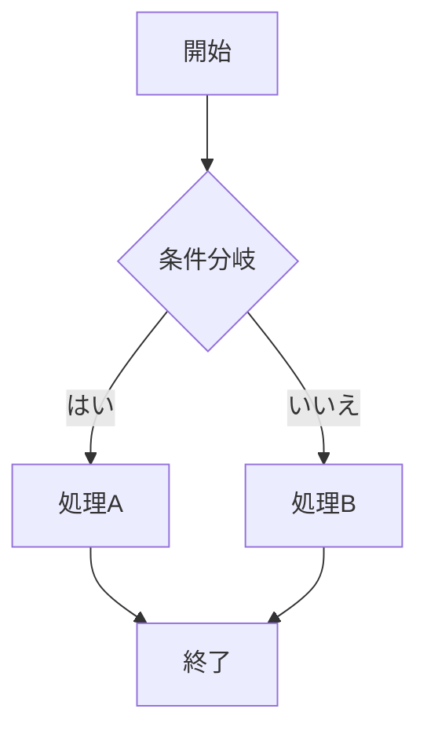
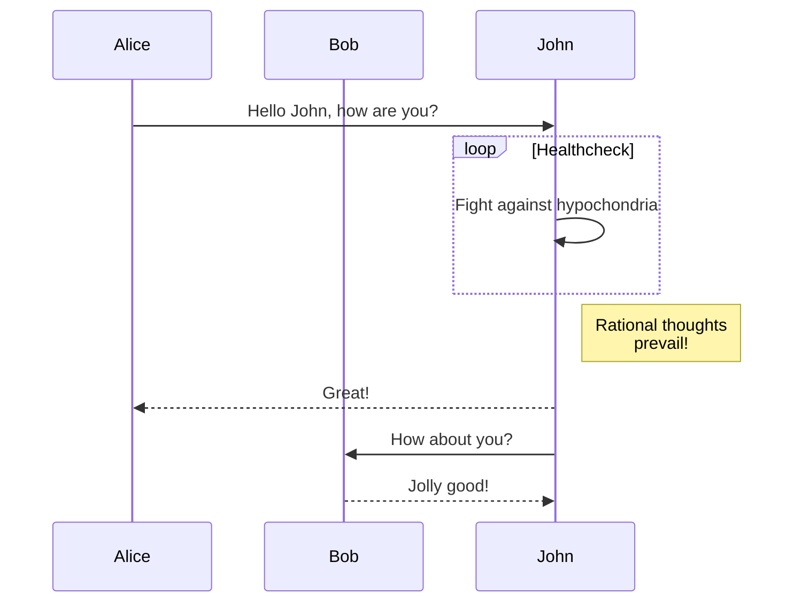
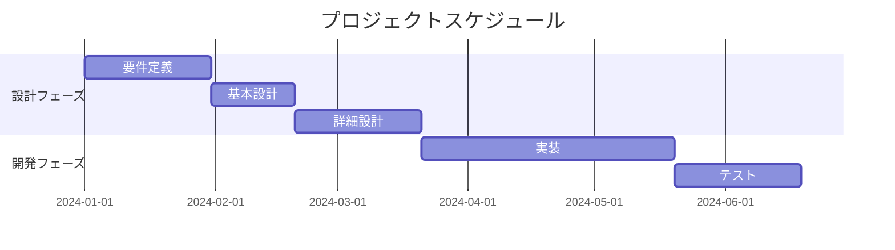
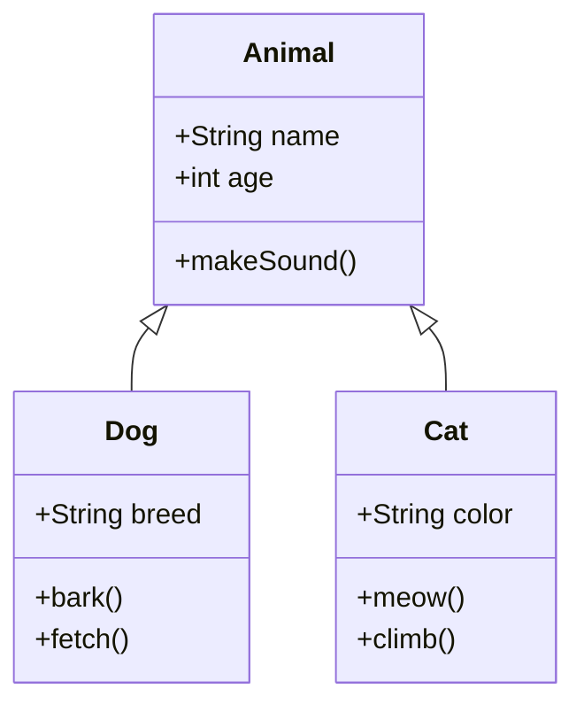

# 高度なMarkdown機能のデモ（拡張機能対応）

このドキュメントは、新しく実装されたMarkdown機能をテストするためのサンプルです。

**使い方:**

1. ノート編集画面でこのファイルの内容をコピー＆ペーストしてプレビューを確認
2. 各機能が正しく動作するかをテスト
3. 新しい機能を追加した際の動作確認用として使用

**開発者向け:**

- 新しいMarkdown機能を追加した際は、このファイルに例を追加してテスト
- バグ報告の際は、このファイルの該当部分を使って再現確認
- ドキュメント作成時の参考例として活用

## 目次

[TOC]

## 1. 拡張Markdown機能

### 詳細・要約ブロック

:::details クリックして詳細を表示
ここに詳細な内容を記述します。

- リスト項目1
- リスト項目2
- リスト項目3

詳細ブロックの中でも **太字** や _斜体_ が使用できます。
:::

### 注記ブロック

:::note info
これは情報メッセージです。重要な情報を伝えるときに使用します。
:::

:::note warn
これは警告メッセージです。注意が必要な内容を表示します。
:::

:::note alert
これは緊急の注意喚起です。重要な警告を表示します。
:::

:::note success
これは成功メッセージです。操作が正常に完了したことを示します。
:::

:::note error
これはエラーメッセージです。問題が発生したことを示します。
:::

:::note tip
これはヒントです。便利な情報やコツを共有するときに使用します。
:::

### ファイル名付きコードブロック

```typescript:types.ts
interface User {
  id: number;
  name: string;
  email: string;
  isActive: boolean;
}

export type { User };
```

```javascript:utils.js
function formatDate(date) {
  return new Intl.DateTimeFormat('ja-JP').format(date);
}

module.exports = { formatDate };
```

### チェックボックス（タスクリスト）

- [x] 完了したタスク
- [ ] 未完了のタスク
- [x] もう一つの完了したタスク
- [ ] 別の未完了タスク

## 2. 従来の機能

### インラインコード

ファイルパスは `src/components/MyComponent.vue` のようにバッククォートで囲みます。

変数名 `userName` や関数名 `getUserById()` もインラインコードで表示できます。

## 3. 数式レンダリング（KaTeX）

### インライン数式

円の面積は $A = \pi r^2$ で計算できます。

### ブロック数式

二次方程式の解の公式：

$$x = \frac{-b \pm \sqrt{b^2 - 4ac}}{2a}$$

### 複雑な数式例

行列の表記：

$$
\begin{pmatrix}
a & b \\
c & d
\end{pmatrix}
\begin{pmatrix}
x \\
y
\end{pmatrix}
=
\begin{pmatrix}
ax + by \\
cx + dy
\end{pmatrix}
$$

## 4. テーブル

### 基本的なテーブル

| 名前     | 年齢 | 職業                   |
| -------- | ---- | ---------------------- |
| 田中太郎 | 25   | エンジニア             |
| 佐藤花子 | 30   | デザイナー             |
| 鈴木一郎 | 28   | プロダクトマネージャー |

### 複雑なテーブル

| 項目               | 説明                           | ステータス | 進捗 |
| :----------------- | :----------------------------- | :--------: | ---: |
| フロントエンド開発 | React/Vue.jsを使用した画面開発 |  🟢 完了   | 100% |
| バックエンド開発   | Node.js/Express APIの実装      | 🟡 進行中  |  75% |
| データベース設計   | PostgreSQLスキーマ設計         |  🟢 完了   | 100% |
| テスト実装         | Unit/Integration テスト        | 🔴 未着手  |   0% |

## 5. シンタックスハイライト

### デバッグ用テストケース

#### 通常のコードブロック（行番号なし）

```typescript
interface User {
  id: number;
  name: string;
}

class UserService {
  private users: User[] = [];
  
  addUser(user: User): void {
    this.users.push(user);
  }
}
```

#### 行番号付きコードブロック

```typescript=1
interface User {
  id: number;
  name: string;
}

class UserService {
  private users: User[] = [];
  
  addUser(user: User): void {
    this.users.push(user);
  }
}
```

### JavaScript/TypeScript

```typescript
interface User {
  id: number;
  name: string;
  email: string;
}

const users: User[] = [
  { id: 1, name: 'Alice', email: 'alice@example.com' },
  { id: 2, name: 'Bob', email: 'bob@example.com' },
];

function findUserById(id: number): User | undefined {
  return users.find((user) => user.id === id);
}
```

### Python

```python
import numpy as np
import matplotlib.pyplot as plt

def fibonacci(n):
    """フィボナッチ数列を生成する関数"""
    if n <= 1:
        return n
    return fibonacci(n-1) + fibonacci(n-2)

# フィボナッチ数列の最初の10項を生成
fib_sequence = [fibonacci(i) for i in range(10)]
print(f"フィボナッチ数列: {fib_sequence}")
```

### 行番号付きコード

```javascript=1
// ファイル: app.js
const express = require('express');
const app = express();
const port = 3000;

app.get('/', (req, res) => {
  res.send('Hello World!');
});

app.listen(port, () => {
  console.log(`Server running at http://localhost:${port}`);
});
```

### 行番号付きTypeScript

```typescript=1
interface User {
  id: number;
  name: string;
  email: string;
  createdAt: Date;
}

interface ApiResponse<T> {
  data: T;
  status: number;
  message: string;
}

class UserService {
  private users: User[] = [];

  async fetchUserData(userId: number): Promise<ApiResponse<User>> {
    const response = await fetch(`/api/users/${userId}`);
    const data = await response.json();
    return data;
  }

  addUser(user: User): void {
    this.users.push(user);
  }

  getUserById(id: number): User | undefined {
    return this.users.find(user => user.id === id);
  }

  getAllUsers(): User[] {
    return [...this.users];
  }
}

// Usage example with error handling
const userService = new UserService();
try {
  const response = await userService.fetchUserData(1);
  console.log(response.data.name);
} catch (error) {
  console.error("Failed to fetch user:", error);
}
```

### インデント処理テスト用コード

```javascript=1
function complexFunction() {
    if (condition) {
        for (let i = 0; i < array.length; i++) {
            if (array[i].isValid) {
                console.log("Processing item:", array[i]);
                
                // ネストされた処理
                array[i].items.forEach(item => {
                    if (item.status === 'active') {
                        processItem(item);
                    }
                });
            }
        }
    }
}
```

### ホワイトスペーステスト

```typescript=1
interface    User    {
  id:    number;
  name:    string;
  email:    string;
}

const    obj    =    {
    key1:    "value1",
    key2:    "value2",
    key3:    "value3"
};

function    testFunction    (    param1:    string,    param2:    number    )    {
    return    param1    +    param2;
}
```

### 行番号付きPython（50行目から開始）

```python=50
def fibonacci(n):
    """フィボナッチ数列のn番目を計算"""
    if n <= 1:
        return n
    return fibonacci(n-1) + fibonacci(n-2)

def factorial(n):
    """階乗を計算"""
    if n <= 1:
        return 1
    return n * factorial(n-1)

class Calculator:
    def __init__(self):
        self.history = []
    
    def add(self, a, b):
        result = a + b
        self.history.append(f"{a} + {b} = {result}")
        return result

# メイン処理
if __name__ == "__main__":
    calc = Calculator()
    print("計算結果:", calc.add(10, 20))
    print("フィボナッチ数列の10番目:", fibonacci(10))
    print("5の階乗:", factorial(5))
```

## 6. 図表サポート（Mermaid）

### フローチャート



### シーケンス図



### ガントチャート



### クラス図



## 7. 警告ボックス

:::note success
**成功メッセージ**
これは成功を示す警告ボックスです。正常に処理が完了したことを表示します。
:::

:::note info
**情報メッセージ**
これは情報を提供する警告ボックスです。ユーザーに有用な情報を伝えます。
:::

:::note warn
**警告メッセージ**
これは注意が必要な内容を示す警告ボックスです。ユーザーの注意を促します。
:::

:::note alert
**危険メッセージ**
これは危険や重要な注意事項を示す警告ボックスです。重大な問題について警告します。
:::

## 8. タスクリスト

- [x] 数式レンダリング機能の実装
- [x] シンタックスハイライト機能の実装
- [x] Mermaid図表サポートの実装
- [ ] PlantUMLサポートの実装
- [ ] エクスポート機能の追加
- [ ] 印刷スタイルの最適化

## 9. テーブル

| 機能                   | 状態      | 優先度 | 備考                 |
| ---------------------- | --------- | ------ | -------------------- |
| 数式レンダリング       | ✅ 完了   | 高     | KaTeX使用            |
| シンタックスハイライト | ✅ 完了   | 高     | highlight.js使用     |
| Mermaid図表            | ✅ 完了   | 中     | 複数の図表タイプ対応 |
| PlantUML               | 🔄 進行中 | 低     | 今後検討             |
| リアルタイム共同編集   | ❌ 未対応 | 低     | 要件外               |

## 10. 画像とサイズ指定

### 通常の画像


### サイズ指定付き画像


## 11. 絵文字サポート

お疲れ様でした！ :smile:
このプロジェクトは素晴らしい成果です :fire: :star:
ぜひ評価をお願いします :thumbsup:

---

このドキュメントを使用して、実装したすべての高度なMarkdown機能が正しく動作することを確認してください。
